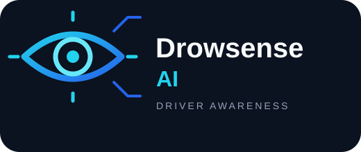

<div align="center">



# Drowsense AI

### Real-Time Driver Drowsiness Detection

A computer-vision project designed to monitor eye activity through a
webcam feed and help identify signs associated with driver drowsiness.


</div>

------------------------------------------------------------------------

## Overview

**Drowsense AI** is a Python-based application with a Flask dashboard
for viewing a live camera feed and drowsiness-related detection
information. The project is organized into separate modules for
detection, calibration, and alerts.

The goal is to explore how computer vision can support driver-awareness
tools through a live visual interface.

> **Safety note:** This is an educational prototype, not a certified
> vehicle-safety system. Do not use it as a substitute for rest,
> attentive driving, or professionally tested safety equipment.

## Features

- **Live camera feed** through the web dashboard.
- **Computer-vision-based eye monitoring** to support drowsiness
  detection.
- **Calibration module** for the detection workflow.
- **Alert handling** for detection events.
- **Web dashboard** for viewing current status and metrics.
- **Windows launcher** (`start.bat`) for easier startup.
- **Modular Python code** split across the application, detector,
  calibration, and alert modules.

## Technology Stack

- **Python** — application logic
- **Flask** — local web server and dashboard endpoints
- **OpenCV** — camera and computer-vision functionality
- **HTML, CSS, JavaScript** — dashboard interface

## Getting Started

### Prerequisites

- Python 3 installed
- A working webcam
- Windows for the `start.bat` launcher
- Git, if you want to clone the repository

### 1. Clone the repository

``` bash
git clone https://github.com/arnavjain0901/Drowsense-AI.git
cd Drowsense-AI
```

### 2. Create a virtual environment

``` bash
python -m venv venv
```

### 3. Activate the virtual environment

On Windows Command Prompt:

``` bat
venv\Scripts\activate
```

### 4. Install dependencies

``` bash
pip install -r requirements.txt
```

### 5. Launch the application

**Windows (recommended):** double-click `start.bat` from the project
folder.

Or, with the virtual environment activated, run:

``` bash
python app.py
```

### 6. Open the dashboard

In your browser, visit:

``` text
http://127.0.0.1:5000
```

Keep the terminal window open while using the app. To stop the local
server, return to that window and press `Ctrl + C`.

## Project Structure

``` text
Drowsense-AI/
├── app.py             # Flask application and web routes
├── detector.py        # Drowsiness-detection logic
├── calibration.py     # Calibration workflow
├── alerts.py          # Alert handling
├── main.py            # Main/standalone entry point
├── requirements.txt   # Python dependencies
├── start.bat          # Windows launcher
├── static/
│   ├── app.js         # Frontend behaviour
│   └── style.css      # Dashboard styling
├── templates/
│   └── index.html     # Dashboard page
└── README.md
```

## Troubleshooting

- **Dashboard does not open:** make sure the terminal shows that the
  Flask server has started, then try `http://127.0.0.1:5000` again.
- **Webcam feed is missing:** check that the camera is connected and not
  being used exclusively by another application.
- **A dependency error appears:** activate the virtual environment and
  run `pip install -r requirements.txt` again.
- **The launcher closes or reports an error:** open Command Prompt in
  the project folder and run `python app.py` to inspect the error
  message.

## Privacy

The application uses a camera feed to provide its live detection
interface. Check the source code and your local configuration to
understand how camera data is handled before using the project in a
shared or network-accessible environment.

## Contributing

Suggestions and improvements are welcome. For a change, consider opening
an issue first, then submit a pull request with a clear description of
what you changed and how you tested it.

## License

No license is specified here. Add a `LICENSE` file if you intend to
publish the project under a particular open-source license.

------------------------------------------------------------------------

<div align="center">

**Built as a computer-vision learning project.**

*Better awareness. Safer journeys.*

</div>
